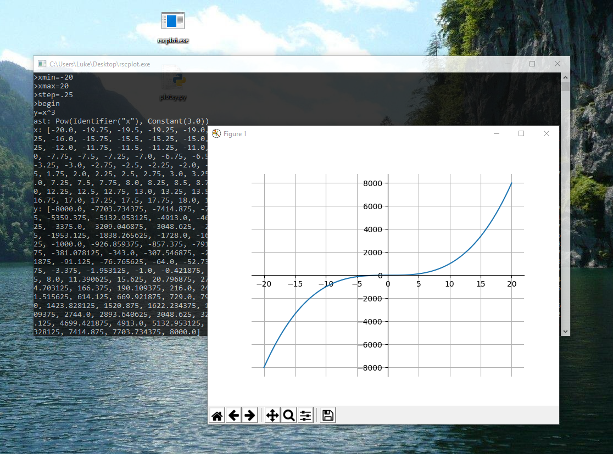
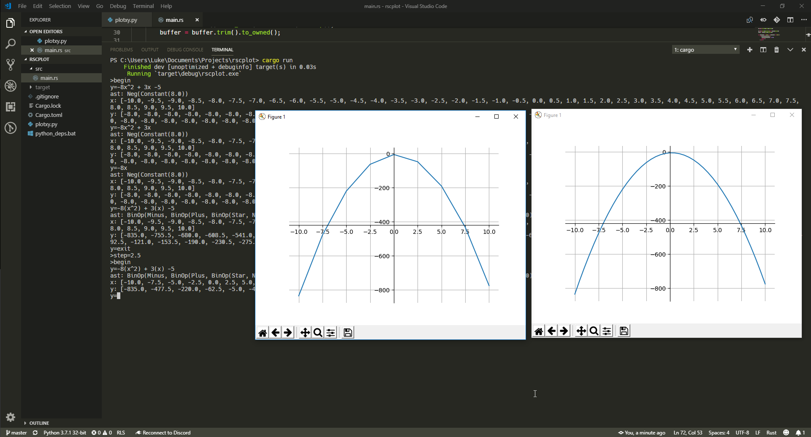

rscplot is a graphing calculator for desktop computers capable of running Python. rscplot is written in the Rust programming language and derives from my other project, [rsc](https://github.com/asmoaesl/rsc).

# Setup
Before one may run the rscplot executable, it is required that Python be installed, and the dependencies installed or updated. Python can be downloaded from https://python.org/. The matplotlib dependency can be downloaded by executing the `python_deps.bat` file.

# Screenshots

